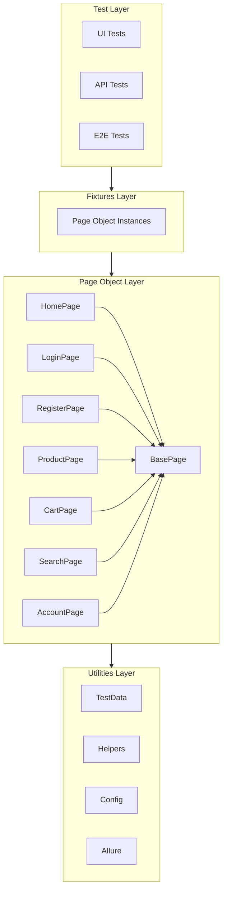
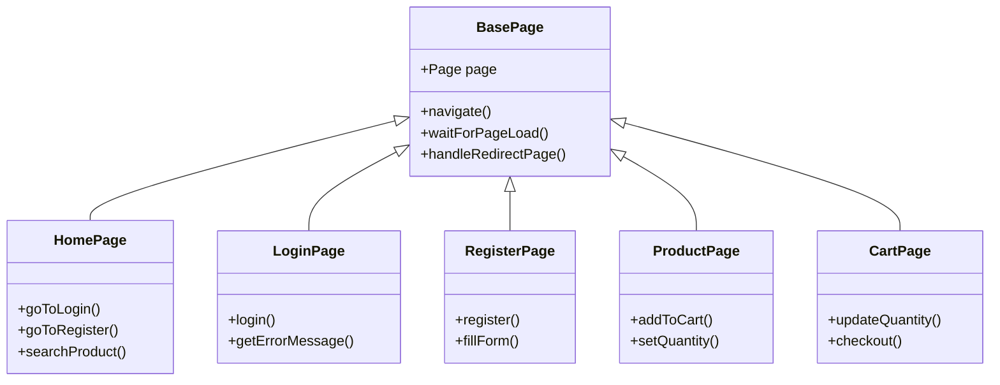
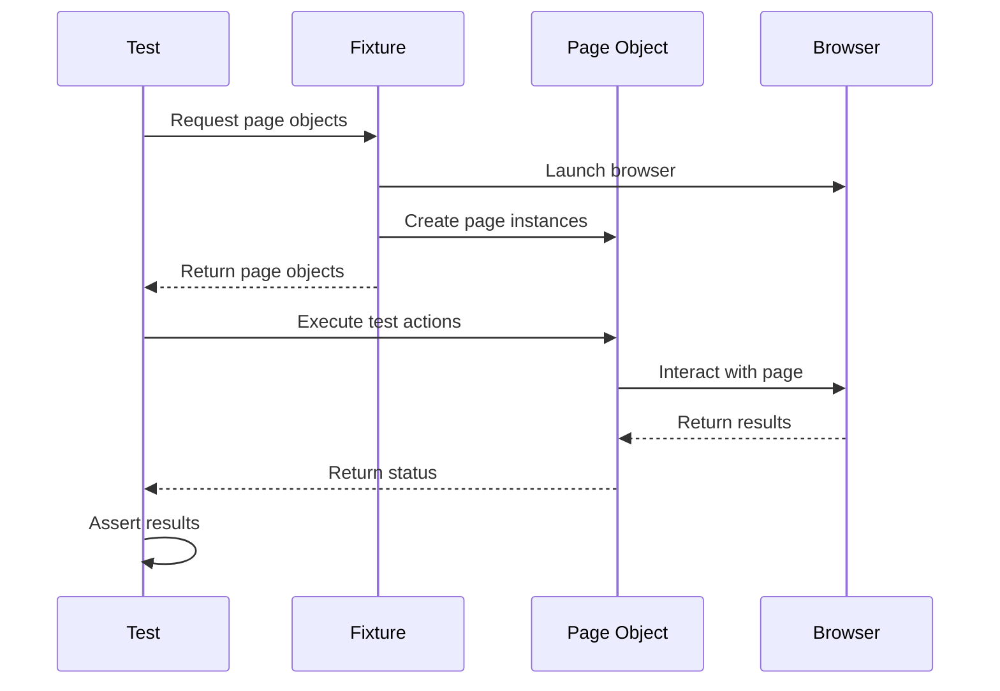
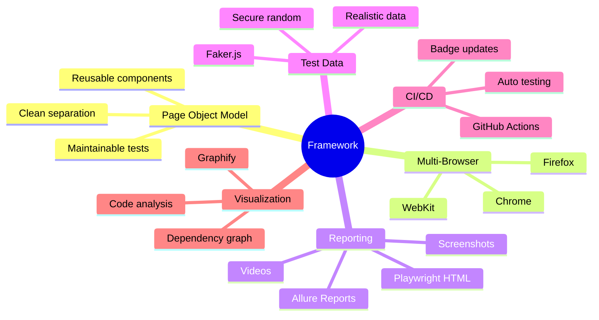
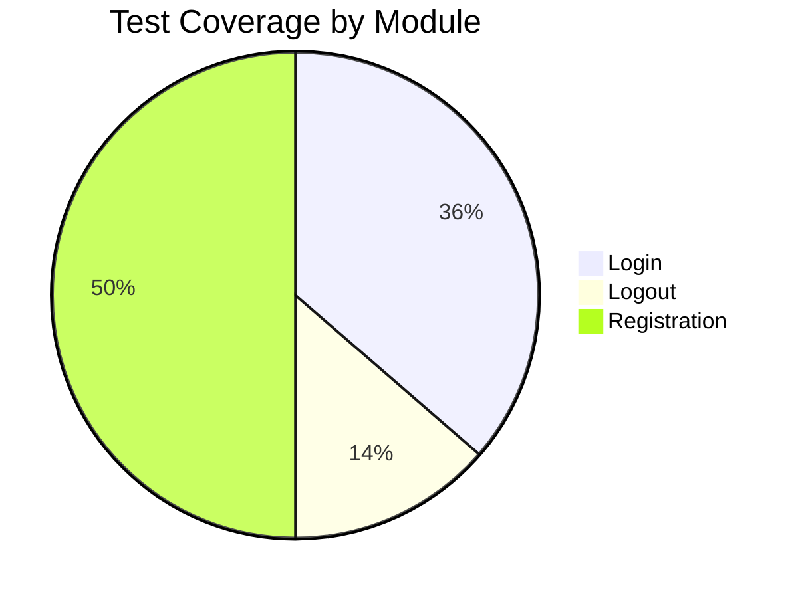

<h1 align="center">eCommerce Playwright Test Automation</h1>

<p align="center">
  <strong>Enterprise-grade end-to-end test automation framework for e-commerce applications</strong>
</p>

<p align="center">
  <a href="https://github.com/farukh43/EcommerceApp/actions/workflows/playwright.yml"></a>
  <a href="https://github.com/farukh43/EcommerceApp"></a>
  <a href="https://github.com/farukh43/EcommerceApp"></a>
  <a href="https://github.com/farukh43/EcommerceApp/blob/main/LICENSE"></a>
</p>

<p align="center">
  <a href="#"></a>
  <a href="#"></a>
  <a href="#"></a>
  <a href="#"></a>
</p>

---

## Table of Contents

- [Overview](#overview)
- [Tech Stack](#tech-stack)
- [Architecture](#architecture)
- [Project Structure](#project-structure)
- [Getting Started](#getting-started)
- [Running Tests](#running-tests)
- [Reports](#reports)
- [Features](#features)
- [Contributing](#contributing)

---

## Overview

A robust, scalable test automation framework built with **Playwright** and **TypeScript** for testing [TutorialsNinja](https://tutorialsninja.com/demo/) e-commerce platform. Implements industry best practices including Page Object Model, data-driven testing, and comprehensive reporting.

---

## Tech Stack

<table>
  <tr>
    <td align="center" width="96">
      
      <br>Playwright
    </td>
    <td align="center" width="96">
      
      <br>TypeScript
    </td>
    <td align="center" width="96">
      
      <br>Node.js
    </td>
    <td align="center" width="96">
      
      <br>Allure
    </td>
    <td align="center" width="96">
      
      <br>Faker.js
    </td>
  </tr>
</table>

| Category | Technologies |
|----------|-------------|
| **Test Framework** | Playwright with TypeScript |
| **Language** | TypeScript 5.x |
| **Runtime** | Node.js v18+ |
| **Reporting** | Playwright HTML + Allure |
| **Test Data** | Faker.js (Cryptographically Secure) |
| **Visualization** | Graphify |
| **CI/CD** | GitHub Actions |

---

## Architecture



### Class Relationships



### Test Flow



---

## Project Structure

<!-- AUTO-GENERATED: Run `npm run docs:structure` to update -->
```
eCommerceApp/
├── src/
│   ├── pages/                    # Page Object Model classes
│   │   ├── BasePage.ts           # Base class with common methods
│   │   ├── HomePage.ts           # Home page actions
│   │   ├── LoginPage.ts          # Login functionality
│   │   ├── RegisterPage.ts       # Registration
│   │   ├── ProductPage.ts        # Product details
│   │   ├── SearchPage.ts         # Search results
│   │   ├── CartPage.ts           # Shopping cart
│   │   └── AccountPage.ts        # User account
│   │
│   ├── tests/
│   │   ├── ui/                   # UI functional tests
│   │   │   ├── auth/             # Authentication tests
│   │   │   ├── products/         # Product tests
│   │   │   ├── cart/             # Cart tests
│   │   │   └── checkout/         # Checkout tests
│   │   ├── api/                  # API tests
│   │   └── e2e/                  # End-to-end flows
│   │
│   ├── fixtures/                 # Playwright fixtures
│   ├── data/                     # Test data (Faker.js)
│   ├── config/                   # Configuration
│   └── utils/                    # Helper utilities
│
├── reports/                      # Playwright HTML reports
├── allure-results/               # Allure raw data
├── allure-report/                # Allure HTML report
├── graphify-out/                 # Codebase visualization
│
├── playwright.config.ts          # Playwright configuration
├── tsconfig.json                 # TypeScript configuration
├── package.json                  # Dependencies
└── CLAUDE.md                     # AI assistant context
```

---

## Getting Started

### Prerequisites

| Requirement | Version |
|------------|---------|
| Node.js | v18.0+ |
| npm | v9.0+ |
| Git | Latest |

### Installation

```bash
# Clone the repository
git clone https://github.com/farukh43/EcommerceApp.git

# Navigate to project
cd EcommerceApp

# Install dependencies
npm install

# Install Playwright browsers
npx playwright install

# Set up environment
cp .env.example .env
```

### Configuration

Update `.env` with your credentials:
```env
TEST_USER_EMAIL=your_email@example.com
TEST_USER_PASSWORD=your_password
```

---

## Running Tests

### Quick Start

```bash
# Run all tests
npm test

# Run with UI mode
npm run test:headed
```

### Test Commands

| Command | Description |
|---------|-------------|
| `npm test` | Run all tests |
| `npm run test:headed` | Run with browser visible |
| `npm run test:debug` | Debug mode |
| `npm run test:ui` | UI tests only |
| `npm run test:api` | API tests only |
| `npm run test:e2e` | E2E tests only |
| `npm run test:chrome` | Chrome only |
| `npm run test:firefox` | Firefox only |

### Specific Test Suites

```bash
# Authentication tests
npm run test:ui:auth

# Run specific test file
npx playwright test src/tests/ui/auth/login.spec.ts

# Run with specific browser
npx playwright test --project=chromium
```

---

## Reports

### Playwright HTML Report

```bash
npm run report
```

### Allure Report

```bash
npm run allure:report
```

**Allure Features:**
- Test execution trends
- Screenshots on failure
- Video recordings
- Detailed test steps
- Categories & labels

### Graphify Visualization

```bash
# Generate codebase visualization
npm run graphify

# Open interactive graph
# Open graphify-out/graph.html in browser
```

---

## Features



| Feature | Description |
|---------|-------------|
| **Page Object Model** | Clean separation of test logic and page interactions |
| **Multi-Browser** | Cross-browser testing with Chrome, Firefox, WebKit |
| **Dual Reporting** | Playwright HTML and Allure integration |
| **Faker.js Data** | Cryptographically secure random test data |
| **Auto Screenshots** | Automatic capture on test failures |
| **Video Recording** | Video recordings for debugging |
| **Auto Retry** | Configurable retry for flaky tests |
| **Graphify** | Interactive codebase visualization |

---

## Test Coverage



| Module | Tests | Status |
|--------|:-----:|:------:|
| Login | 8 | Completed |
| Logout | 3 | Completed |
| Registration | 11 | Completed |
| Search | - | Planned |
| Cart | - | Planned |
| Checkout | - | Planned |

---

## Configuration Files

| File | Purpose |
|------|---------|
| `playwright.config.ts` | Playwright settings, browsers, timeouts |
| `tsconfig.json` | TypeScript compiler options |
| `.env` | Environment variables (credentials) |
| `allure-categories.json` | Allure report categories |
| `.mcp.json` | Playwright MCP server config |
| `CLAUDE.md` | AI assistant project context |

---

## Contributing

1. **Fork** the repository
2. **Create** feature branch (`git checkout -b feature/AmazingFeature`)
3. **Commit** changes (`git commit -m 'Add AmazingFeature'`)
4. **Push** to branch (`git push origin feature/AmazingFeature`)
5. **Open** Pull Request

---

## License

This project is licensed under the **ISC License**.

---

<p align="center">
  <strong>Built with Playwright & TypeScript</strong>
</p>

<p align="center">
  <a href="https://github.com/farukh43/EcommerceApp/stargazers">
    
  </a>
  <a href="https://github.com/farukh43/EcommerceApp/network/members">
    
  </a>
</p>
